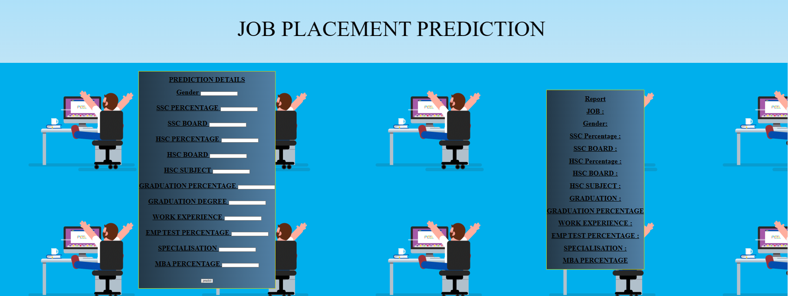

    JOB PLACEMENT PREDICTION 

    Introduction:
    This report provides an overview of the machine learning prediction model developed for job placement. The goal of this model is to predict the likelihood of a candidate getting placed in a job based on their qualifications, skills, and other relevant factors.

    Model Overview:
    The job placement prediction model is built using machine learning techniques, specifically a supervised learning approach. It is designed to make predictions based on historical data of candidates and their job placement outcomes. The model takes various features into account, including:

<h4>candidate Qualifications : Educational background, degrees, and certifications.</h4>
<h4>Skills and Experience: Relevant skills and years of experience.</h4>
<h4>Gradution degree: graduation degree and percentage </h4>
<h3> Also other diiferent attributes 
</h3>

<h3>Data Collection and Preprocessing:<h3>
    <h3>
    The success of the model heavily relies on the quality of 
    the data. In this project, data was collected from
     historical job placement records and candidate profiles. 
     The data went through preprocessing steps, including data cleaning,
      feature engineering, and encoding categorical variables.</h3>

<h3>Model Evaluation:<h3>
    <h3>
    The model's performance was assessed using standard evaluation metrics, including:
    
    Accuracy: The ratio of correctly predicted placements to the total predictions.
    Precision: The ratio of true positive predictions to the total positive predictions.
    Recall: The ratio of true positive predictions to the total actual positive cases.
    Additionally, the model's performance was validated through cross-validation to ensure its generalizability to unseen data.</h3>

<h3>
    Conclusion:<h3>
        <h3>
The job placement prediction model presented in this report offers a valuable solution for optimizing the job placement process. By leveraging machine learning techniques and historical data, it provides accurate predictions to assist in matching candidates with suitable job opportunities, ultimately improving job placement outcomes. Further refinements and updates to the model can enhance its predictive power and usability in the future.
</h3>

